# Este projeto foi desenvolvido no desafio da formação de **MBA em Desenvolvimento Mobile**.

<h4 align="center">
    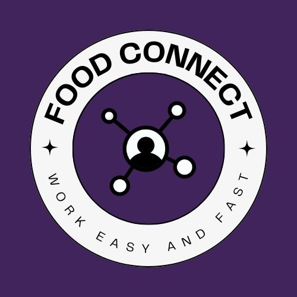
</h4>

## Sobre o Projeto
O FoodConnect é uma plataforma que visa conectar freelancers a estabelecimentos de restaurantes e bares para oportunidades de trabalho temporário. 

* Layout do projeto [Figma](https://www.figma.com/file/I5HtyNtykdJAQ0mAUeHyuh/FoodConnect?type=design&mode=design&t=WXGsitWIh3jUpXG7-0)

## Tecnologias Utilizadas

Esse projeto foi desenvolvido com as seguintes tecnologias:

- [Typescript](https://www.typescriptlang.org/)
- [React Native](https://reactnative.dev/)
- [Expo](https://expo.dev/)
- [Axios](https://axios-http.com/ptbr/docs/intro)
- [Styled Components](https://styled-components.com/)

-------------

## 📝 Pré-requisitos

Para rodar este projeto é necessário ter instalado na sua máquina as seguntes tecnologias:

- É necessário possuir o [Node.js](https://nodejs.org/en/) instalado na máquina.
- Também, é preciso ter um gerenciador de pacotes seja [Yarn](https://yarnpkg.com/) ou [NPM](https://www.npmjs.com/).
- Nesse projeto utilizei o [Expo](https://expo.dev/).

## Para rodar o projeto

1. Instale as dependências: `yarn`
2. Startar a aplicação: `yarn start`
3. Escolher o emulador da sua preferencia.

## 📷 Resultado

<h1 align="center">
     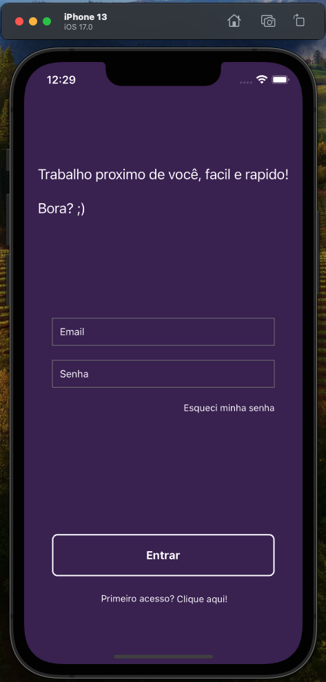
     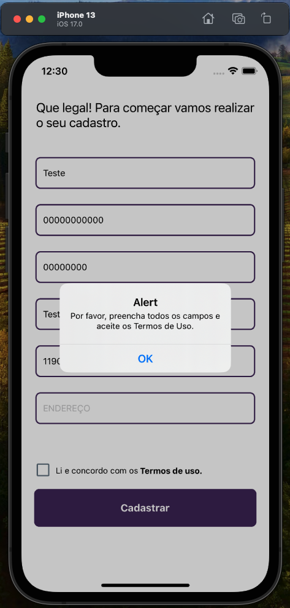
     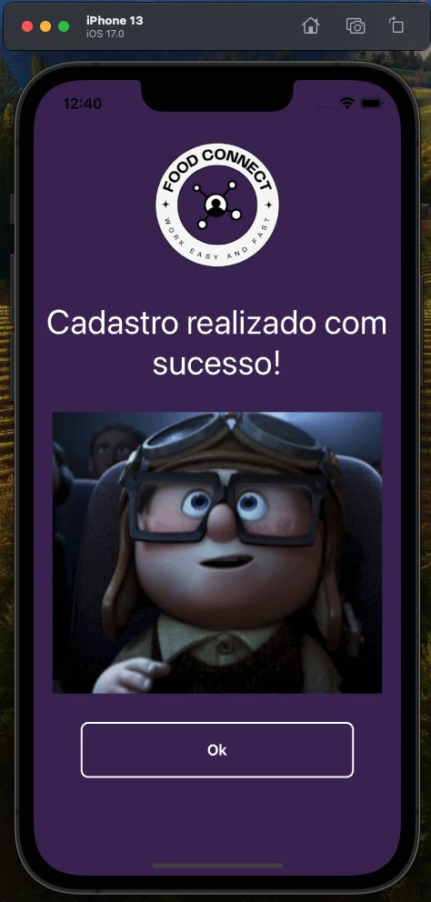
     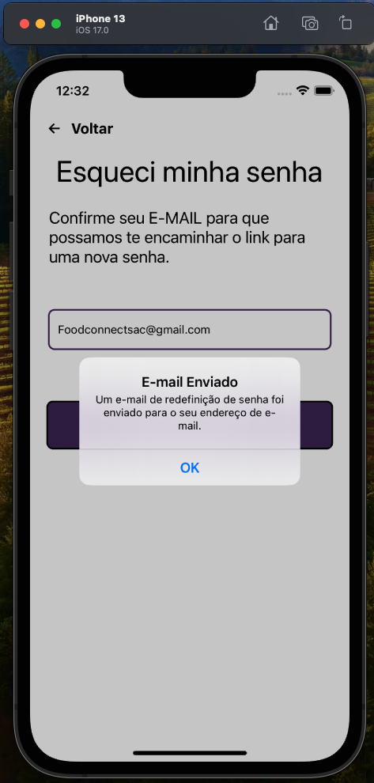
     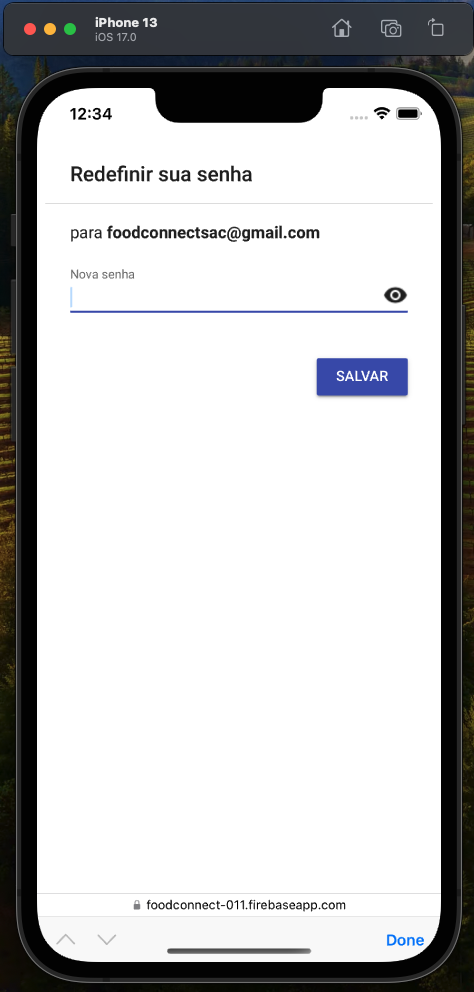
     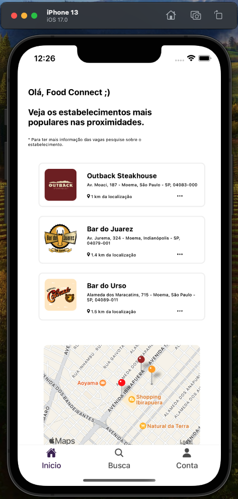
     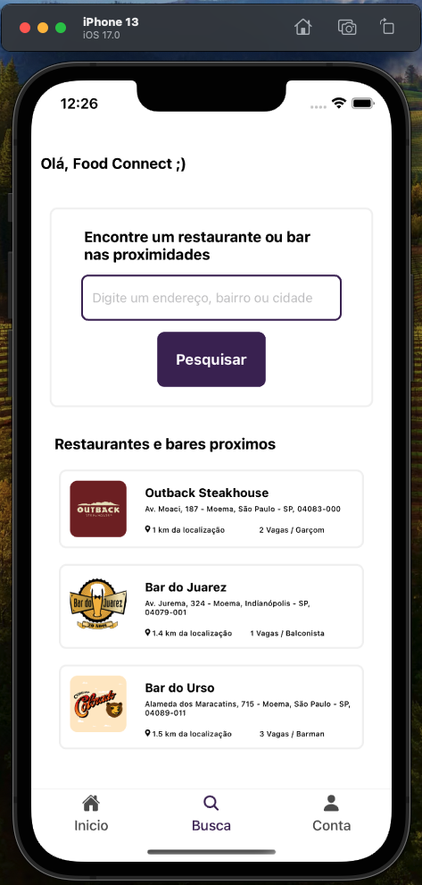
     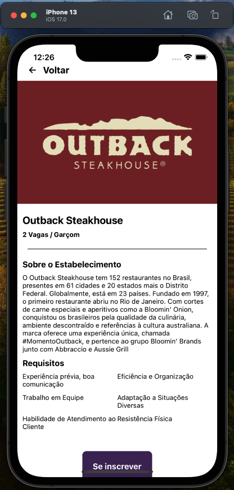
     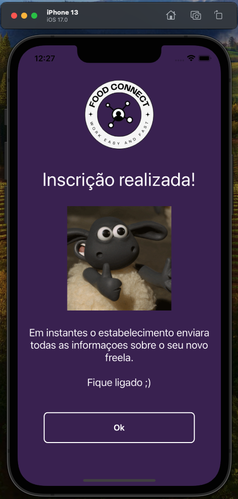
     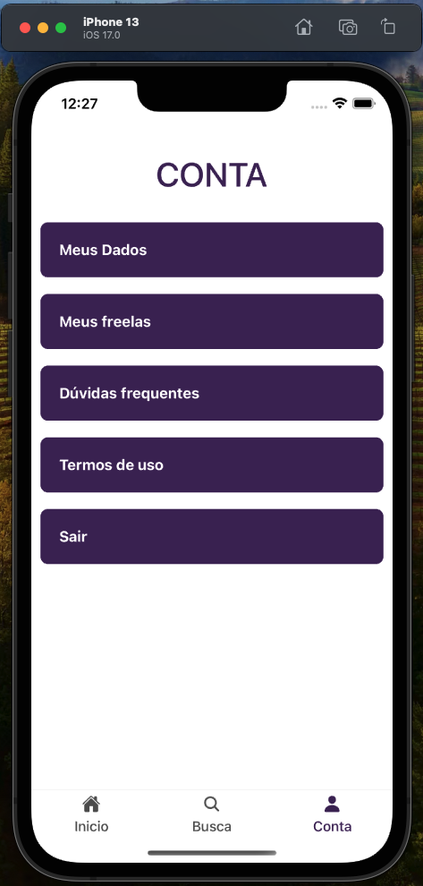
     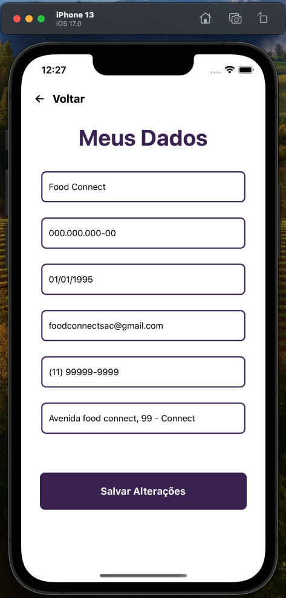
     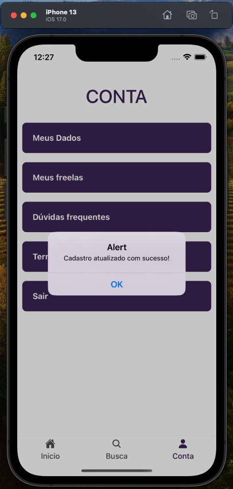
     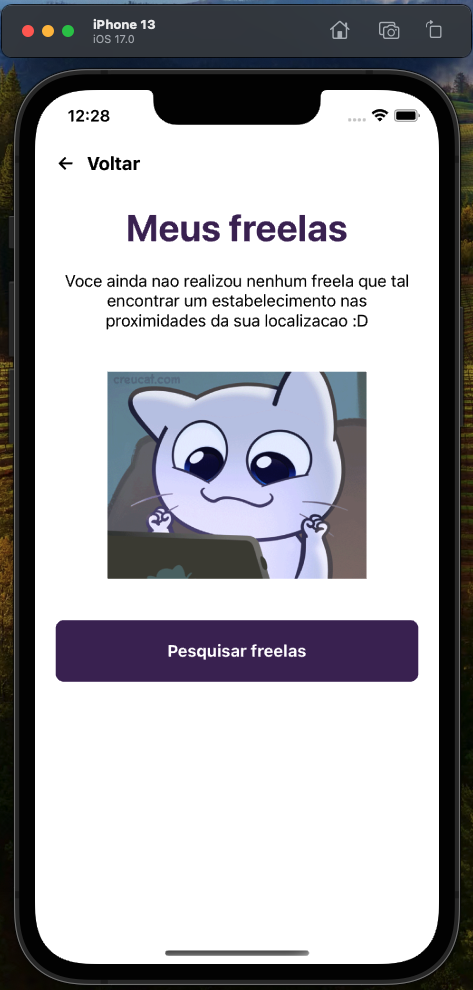
     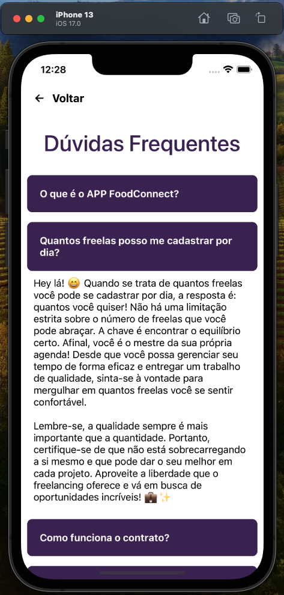
     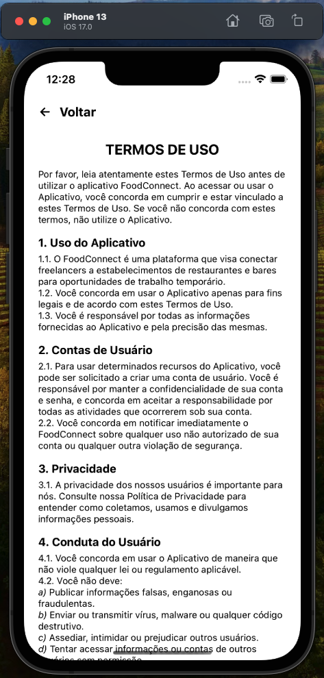
    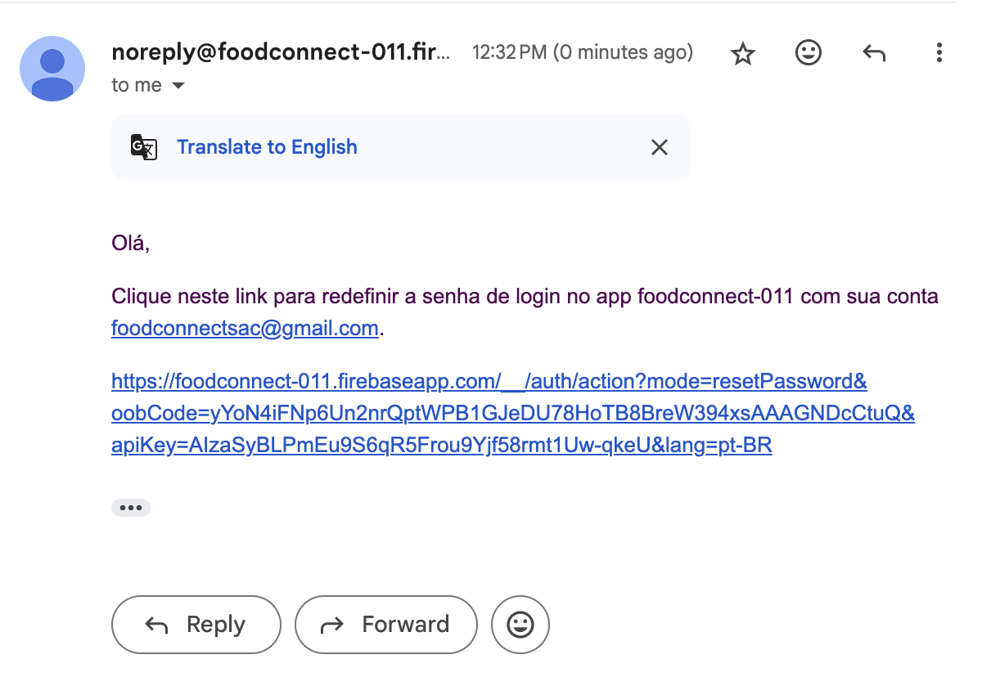
</h1>
